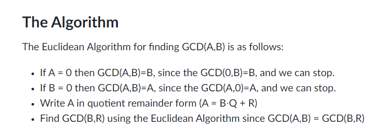

# Ejercicios de calentamiento (Sparring) semana 1

### Instructions
Construir un programa en Python 3.11 que resuelva cada uno de los siguientes problemas : 
- Dada una cadena S, compuesta por caracteres :
                  c0, c1, c2 ...... cn
    
    
    Determinar aquel caracter ci el cual tiene el mayor número de repeticiones ( No necesariamente contiguas) dentro de S - <span style="color:green;">Done</span>

        Casos de prueba: 
      
        Input:
        anitalavalatina
        ricardo01
        123456777777
        elementaleeeeergo
       
        Output: 
        a -> 6
        r -> 2
        7 -> 6
        e -> 8

- Dado un número n, se deberá componer el WonderSquare de n, un WonderSquare de n se describe por la siguiente sucesión : 
                    1 -> 1

                    2 -> 2 2 2
                            2 1 2
                            2 2 2

                    3 -> 3 3 3 3 3 
                            3 2 2 2 3
                            3 2 1 2 3 
                            3 2 2 2 3
                            3 3 3 3 3

                      4 -> 
                          4 4 4 4 4 4 4
                          4 3 3 3 3 3 4
                          4 3 2 2 2 3 4
                          4 3 2 1 2 3 4
                          4 3 2 2 2 3 4
                          4 3 3 3 3 3 4
                          4 4 4 4 4 4 4
                
               input: 
                     4
              output: 
                          4 4 4 4 4 4 4
                          4 3 3 3 3 3 4
                          4 3 2 2 2 3 4
                          4 3 2 1 2 3 4
                          4 3 2 2 2 3 4
                          4 3 3 3 3 3 4
                          4 4 4 4 4 4 4

- Determinar si una cadena S es un palindromo, un palindromo es aquella sucesión de caracteres en donde ci = cn-i para todo i > 0 - <span style="color:green;">Done</span>

         input: 
              anitalavalatina
              ernesto
              a
              abalorio 
         
         output: 
             True
             False
             True
             False
- Determinar el MCD de dos números enteros i,j

       input
        2 6
        6 12
        200 13
       
       Output: 
        2
        6
        1

**Entregables:** .zip con las implementaciones, usar el conocimiento existente de sus cursos anteriores de programación, el formato de las entradas del usuario están definidas en la categoría **Input**, la salida esperada esta en la categoría **Output**. 

**Nota** : No es necesario que el programa guarde las entradas o acumule las salidas, por cada caso de entrada (Línea de input) se debe generar una línea de salida (output)

---


```Python 
quotient = dividend // divisor  # Integer division to get the quotient
remainder = dividend % divisor   # Modulo operator to get the remainder
```
